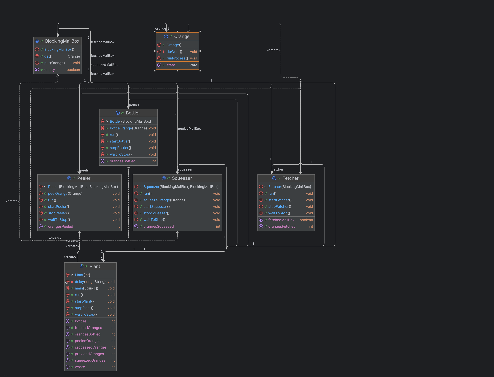

# JuiceBottler

This version of JuiceBottler satisfies all the requirements because it has more than two workers who do different processes of juice bottling. There are four types of workers: fetchers, peelers, squeezers, and bottlers. Each worker class has one thread, and each plant has one thread, so at least five threads are running. The hardest part of the project was to figure out how to run all the workers
connected to each other. To connect them and make them wait for each other before doing anything to oranges, JuiceBottler uses BlockingMailBox so each worker waits for the other to do work. Preventing all threads running at the same time was the hardest. This project also uses ANT to run code. 

